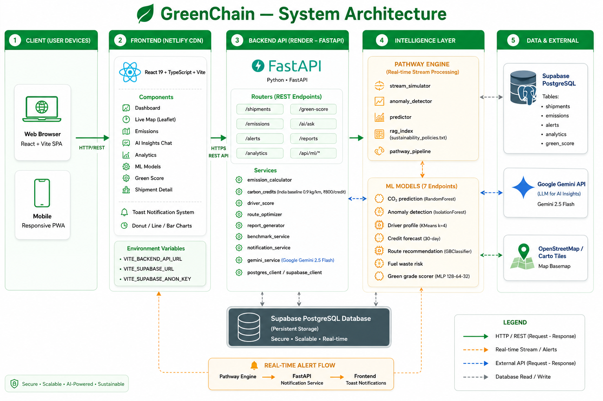

<div align="center">

# 🌿 GreenChain

### AI-Powered Green Logistics & Sustainability Platform

[](https://react.dev)
[](https://vitejs.dev)
[](https://fastapi.tiangolo.com)
[](https://ai.google.dev)
[](https://supabase.com)

**Track emissions. Earn carbon credits. Decarbonize your fleet.**

</div>

---

## 🚀 What is GreenChain?

GreenChain is a real-time sustainability intelligence platform for logistics fleets. It monitors every shipment's carbon footprint, grades drivers and vehicles against India's national emission baseline, and uses Google Gemini to give fleet managers instant, actionable advice — from cutting idle time to switching diesel routes to EV.

---

## 🏗 System Architecture

<p align="center">
  
</p>

The platform is split into five layers:

| # | Layer | Stack |
|---|---|---|
| 1 | **Client** | Web browser · Mobile-responsive PWA |
| 2 | **Frontend** (Netlify CDN) | React 19 · TypeScript · Vite · Leaflet · Toast notifications · Donut / Line / Bar charts |
| 3 | **Backend API** (Render — FastAPI) | Routers (`/shipments`, `/emissions`, `/alerts`, `/analytics`, `/green-score`, `/ai/ask`, `/reports`, `/api/ml/*`) and Services (carbon credits, driver score, route optimizer, Gemini, etc.) |
| 4 | **Intelligence Layer** | Pathway Engine (stream simulator, anomaly detector, predictor, RAG index, pipeline) + 7 ML Models (CO₂ prediction, anomaly detection, driver profile, credit forecast, route recommendation, fuel-waste risk, green-grade scorer) |
| 5 | **Data & External** | Supabase PostgreSQL · Google Gemini 2.5 Flash · OpenStreetMap / Carto tiles |

**Real-time alert flow**

```
Pathway Engine  →  FastAPI Notification Service  →  Frontend Toast Notifications
```

---

## ✨ Features

| Feature | Description |
|---|---|
| **Live Shipment Tracking** | Real-time GPS, speed, fuel burn, and ETA per shipment |
| **Green Score Grading** | A–F grade per shipment based on CO₂ efficiency, driver behaviour, vehicle type, and load factor |
| **Carbon Credit Engine** | Auto-calculates credits earned vs India's 0.90 kg CO₂/km baseline (Gold Standard VER) |
| **AI Copilot** | Ask Gemini anything — "where is money being wasted on fuel?" — gets real fleet context |
| **Smart Alerts** | In-app toast notifications for emission spikes, harsh braking, idling, and delay risks |
| **Interactive Map** | Live shipment pins on Leaflet/OpenStreetMap, filterable by vehicle type and grade |
| **Route Alternatives** | AI-ranked EV/CNG/rail recommendations per lane |
| **ML Insights** | Seven predictive models surfaced as a single dashboard |
| **Carbon Footprint Donut** | Vehicle-type breakdown with weekly / monthly trend toggle |

---

## 📱 App Pages

```
Dashboard     →  Fleet KPIs, quick actions, alerts, shipments
Live Map      →  Labeled origin/destination markers (A, B, C…) + pulsing live truck pins
Emissions     →  Carbon footprint donut + weekly/monthly trend + benchmarks
AI Insights   →  Gemini-powered sustainability copilot
Analytics     →  Trend chart, driver leaderboard, industry benchmarks
ML Models     →  7 model cards (CO₂, Anomaly, Driver, Forecast, Route, Fuel, Score)
Green Score   →  Overall grade, carbon-credit ledger, achievement milestones
Shipment ID   →  Full intelligence per shipment (KPIs, donut, timeline, ops table)
```

---

## 🌱 Emission Benchmarks

| Mode | CO₂/km | GreenChain Grade |
|------|--------|------------------|
| Diesel Truck | 0.90 kg | Baseline (India avg) |
| CNG Truck | 0.52 kg | B–C |
| EV Truck | 0.05 kg | A+ |
| Rail Freight | 0.015 kg | A+ |
| **EU 2030 Target** | **0.55 kg** | — |

---

## 🛠 Tech Stack

**Frontend**
- React 19 + TypeScript + Vite 5
- React Router (custom lightweight router)
- Leaflet.js (interactive map, no API key needed)
- Custom toast notification system
- Custom SVG donut, line, and bar chart components
- Deployed on **Netlify**

**Backend**
- FastAPI + Uvicorn
- Google Gemini 2.5 Flash (AI copilot, with model fallback chain)
- Supabase (PostgreSQL, with local seed-mode fallback)
- Pathway streaming engine (live telemetry simulator)
- RAG policy engine (sustainability policies, keyword-scored retrieval)
- Deployed on **Render**

---

## ⚡ Quick Start

### Prerequisites
- Node.js 18+ and npm
- Python 3.11+
- A Supabase project (or run with the local seed dataset)
- Google Gemini API key

---

### Backend Setup

```powershell
cd backend
python -m venv .venv
.\.venv\Scripts\Activate.ps1
pip install -r requirements.txt
```

Create `backend/.env`:

```env
SUPABASE_URL=https://your-project.supabase.co
SUPABASE_ANON_KEY=your-anon-key
DATABASE_URL=postgresql://...
GEMINI_API_KEY=your-gemini-api-key
GEMINI_MODEL=gemini-2.5-flash
INDIA_BASELINE_CO2_PER_KM=0.9
CARBON_CREDIT_PRICE_INR=800
MONTHLY_CO2_TARGET_KG=5000
```

Seed and run:

```powershell
python seed_supabase.py
uvicorn main:app --reload --port 8000
```

API: `http://localhost:8000` · Swagger: `http://localhost:8000/docs`

---

### Frontend Setup

```powershell
cd frontend
npm install
npm run dev
```

Create `frontend/.env`:

```env
VITE_BACKEND_API_URL=http://localhost:8000
VITE_SUPABASE_URL=https://your-project.supabase.co
VITE_SUPABASE_ANON_KEY=your-anon-key
```

App: `http://localhost:5173`

---

## 📁 Project Structure

```
greenchain/
├── docs/
│   └── architecture.png      # System architecture diagram
│
├── frontend/                 # React 19 + Vite SPA
│   ├── src/
│   │   ├── pages/            # Dashboard, Emissions, Map, Insights, Analytics, ML, Score, Shipment
│   │   ├── components/       # Shell, UI, Cards, Charts, MapView, Modal, Toast, Chat
│   │   ├── App.tsx           # Route mapping
│   │   ├── router.tsx        # Lightweight client router
│   │   └── theme.ts          # Green-and-white design tokens + city coords
│   ├── hooks/                # useShipments, useAlerts, useGreenScore, useMLInsights, useAIInsights
│   ├── lib/                  # api.ts, notifications.ts, supabase.ts
│   └── public/_redirects     # SPA fallback for Netlify
│
└── backend/                  # FastAPI
    ├── routers/              # shipments, emissions, alerts, analytics,
    │                         # ai_insights, green_score, ml_routes, reports
    ├── services/             # gemini_service, carbon_credits, driver_score,
    │                         # emission_calculator, route_optimizer,
    │                         # report_generator, benchmark_service,
    │                         # notification_service, supabase_client, postgres_client
    ├── pathway_engine/       # stream_simulator, anomaly_detector, predictor,
    │                         # rag_index, pathway_pipeline
    ├── models/               # Pydantic schemas
    └── data/
        └── sustainability_policies.txt   # RAG knowledge base
```

---

## 🤖 AI Copilot — How It Works

1. User asks a question on the **AI Insights** page
2. Backend pulls live fleet stats from the `shipments` table
3. RAG engine keyword-scores sustainability policies, returns the top 5
4. Gemini 2.5 Flash receives: **fleet context + policies + question + chat history**
5. Response is streamed back and rendered as chat with full multi-turn support

Example questions:
- *"Where is money being wasted on fuel?"*
- *"Which shipment should switch to EV first?"*
- *"Explain why SHP-2009 got an F grade"*
- *"How many carbon credits did we earn this week?"*

---

## 🤖 ML Models — 7 Endpoints

| Model | Type | Endpoint |
|---|---|---|
| CO₂ Emission Prediction | RandomForest regression | `/api/ml/predict-co2` |
| Anomaly Detection | IsolationForest | `/api/ml/detect-anomaly` |
| Driver Behaviour Profile | KMeans (k=4) | `/api/ml/driver-profile` |
| Carbon Credit Forecast | Time-series projection | `/api/ml/forecast-credits` |
| Route Mode Recommendation | GBClassifier | `/api/ml/recommend-route` |
| Fuel Waste Early Warning | Pre-trip risk model | `/api/ml/fuel-waste-risk` |
| Green Grade Scorer | MLP (128-64-32) | `/api/ml/score-shipment` |

---

## 🔔 Alerts & Notifications

| Severity | Trigger | UI |
|----------|---------|----|
| 🔴 High / Critical | CO₂/km > 1.0 kg, severe anomaly | Red toast + dashboard banner |
| 🟡 Medium | ETA drift > 30 min, harsh braking cluster | Amber toast |
| 🟢 Low | Mild idling, route suggestion | Blue toast |

In-app toasts replace browser notifications — no permission prompts, no system pop-ups.

---

## 📊 Carbon Credit Calculation

```
credits      = (baseline_co2 − actual_co2) / 1000
baseline_co2 = distance_km × 0.90 kg/km          # India national average
actual_co2   = fuel_litres × 2.68 kg/L            # IPCC AR6 diesel factor

1 credit = 1 tonne CO₂ avoided = ₹800 (~USD 9.50)
```

---

## 🌐 Key API Endpoints

| Method | Endpoint | Description |
|--------|----------|-------------|
| GET | `/shipments/` | All shipments with live telemetry |
| GET | `/shipments/{id}` | Single shipment detail |
| GET | `/shipments/{id}/route-alternatives` | Greener route options |
| GET | `/emissions/` · `/emissions/{shipment_id}` | Fleet / per-shipment emissions |
| GET | `/alerts/` | Active fleet alerts |
| PATCH | `/alerts/{id}/read` | Mark an alert as read |
| GET | `/analytics/fleet-overview` | Aggregated fleet KPIs |
| GET | `/green-score/fleet` | Per-shipment green grades |
| GET | `/reports/fleet-summary` | Carbon credit ledger |
| POST | `/ai/ask` | AI copilot query |
| GET | `/api/ml/*` | 7 ML model endpoints |

Full Swagger docs: `http://localhost:8000/docs`

---

## 🚀 Deployment

| Service | Platform | Config |
|---|---|---|
| Frontend | **Netlify** | `netlify.toml` + `frontend/public/_redirects` (SPA fallback) |
| Backend | **Render** | `render.yaml` |
| Database | **Supabase** | Managed PostgreSQL |

The frontend reads its API base URL from `VITE_BACKEND_API_URL` at build time. The backend reads `DATABASE_URL`, `SUPABASE_*`, and `GEMINI_API_KEY` at runtime.

---

## 🗺 Roadmap

- [ ] Real GPS integration (replace stream simulator)
- [ ] Driver mobile app with score dashboard
- [ ] Multi-tenant fleet management
- [ ] Blockchain-verified carbon credit certificates
- [ ] Rail booking API integration (IRCTC / Rivigo)
- [ ] Scope 3 supply chain reporting export (GHG Protocol)

---

<div align="center">

Made with 💚 for a greener supply chain

</div>
